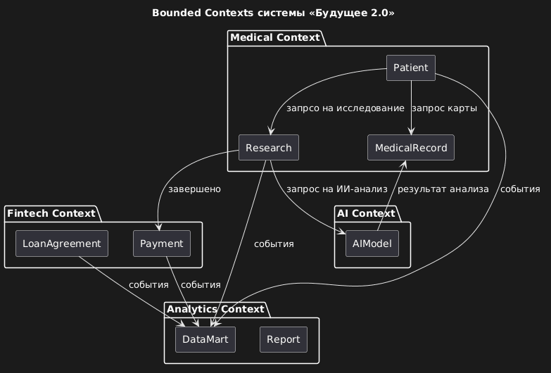
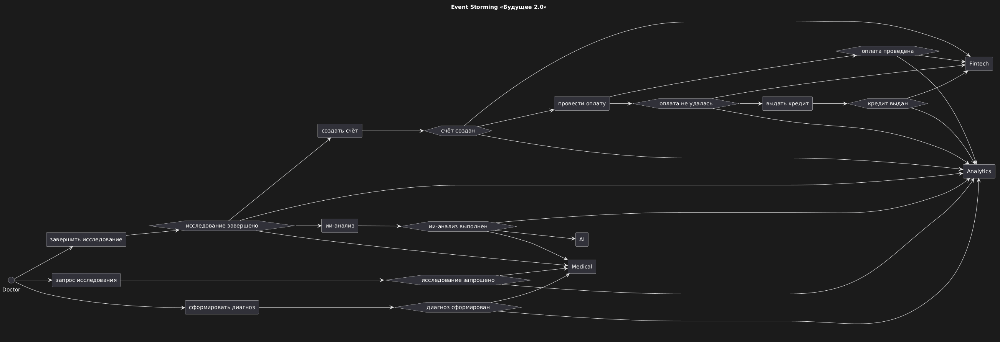

# Задание 4. Моделирование домена и интеграций

## Обзор

В рамках задания система «Будущее 2.0» разделена на домены согласно подхода Domain-Driven Design (DDD). Выделены следующие bounded contexts, агрегаты и события. Целевая архитектура интеграций построена на событийно-ориентированном подходе (Event-Driven Architecture) с использованием брокера сообщений (Kafka). Это позволяет отказаться от жёсткой шины данных (Apache Camel) и монолитного DWH в пользу асинхронного, масштабируемого и гибкого взаимодействия между доменами.

## Артефакты

Все детали представлены в отдельных файлах:

- [bounded-contexts.puml](./bounded-contexts.puml)

- [event-storming.md](./event-storming.puml)

- [aggregates.md](./aggregates.md)

- [events.md](./events.md)

- [justification.md](./justification.md)
